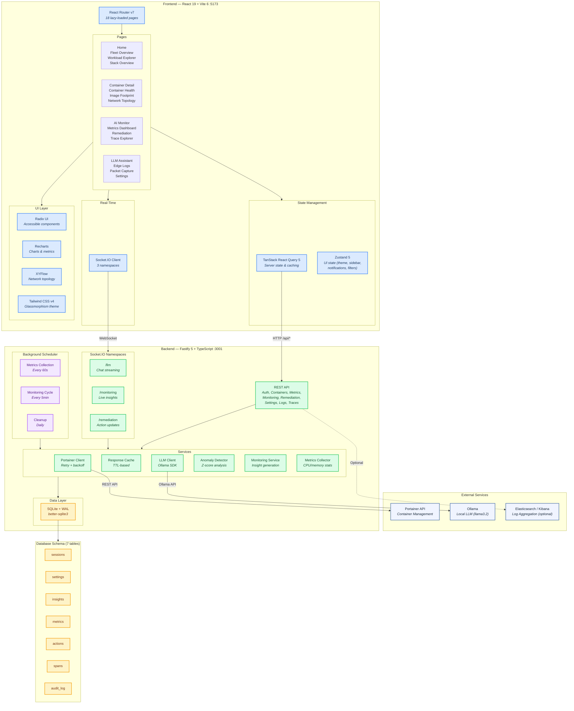
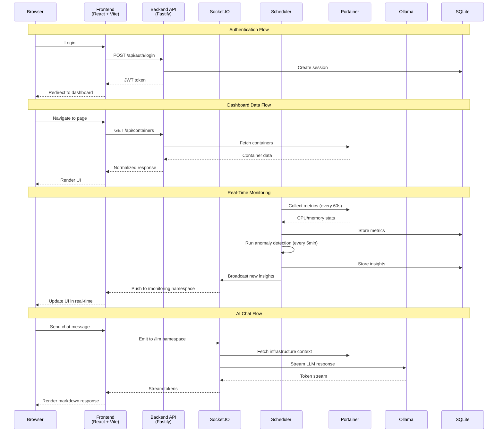

# AI Portainer Dashboard

*Intelligent container monitoring that extends Portainer with AI-powered insights, anomaly detection, and a real-time chat assistant.*

[](https://github.com/kenhaesler/ai-portainer-dashboard/actions/workflows/ci.yml)
[](https://nodejs.org)
[](https://www.typescriptlang.org)
[](LICENSE)

> **Observer-first** — This dashboard focuses on deep visibility into your container infrastructure. Some actions can be triggered through an explicit approval workflow (e.g., remediation execution).

---

## Features

- **Multi-Endpoint Fleet Management** — Connect to multiple Portainer instances from a single pane of glass
- **Real-Time Monitoring** — CPU/memory metrics collected every 60s with z-score anomaly detection
- **AI Intelligence** — LLM-powered insights, anomaly analysis, and conversational chat assistant (Ollama)
- **Automated Remediation** — AI-suggested fixes with approval workflow (pending → approved → executed)
- **Network Topology** — Interactive graph visualization of container networks (XYFlow)
- **Image Footprint Analysis** — Treemap and sunburst visualizations of image sizes across your fleet
- **Distributed Tracing** — Trace explorer for request flow analysis
- **Elasticsearch Integration** — Optional Kibana/Elasticsearch log search
- **Modern UI** — Apple-inspired glassmorphism theme with light/dark modes and command palette (`Ctrl+K`)

---

## Architecture

### Architecture Map (Route → Service/Data)

Backend request flow is organized by route modules, with most Portainer-facing routes using the Portainer client + cache/normalizers. Monitoring and metrics read/write directly to SQLite.

| Route Area | Primary Routes | Service/Data Dependencies |
|---|---|---|
| Auth | `/api/auth/*` | `services/session-store.ts`, `services/audit-logger.ts` |
| OIDC | `/api/auth/oidc/*` | `services/oidc.ts`, `services/session-store.ts`, `services/audit-logger.ts` |
| Dashboard | `/api/dashboard/summary` | `services/portainer-client.ts`, `services/portainer-cache.ts`, `services/portainer-normalizers.ts` |
| Endpoints | `/api/endpoints*` | `services/portainer-client.ts`, `services/portainer-cache.ts`, `services/portainer-normalizers.ts` |
| Containers | `/api/containers*` | `services/portainer-client.ts`, `services/portainer-cache.ts`, `services/portainer-normalizers.ts` |
| Container Logs | `/api/containers/:eid/:cid/logs` | `services/portainer-client.ts` |
| Images | `/api/images*` | `services/portainer-client.ts`, `services/portainer-cache.ts`, `services/portainer-normalizers.ts` |
| Networks | `/api/networks*` | `services/portainer-client.ts`, `services/portainer-cache.ts`, `services/portainer-normalizers.ts` |
| Stacks | `/api/stacks*` | `services/portainer-client.ts`, `services/portainer-cache.ts`, `services/portainer-normalizers.ts` |
| Search | `/api/search` | `services/portainer-client.ts`, `services/portainer-cache.ts`, `services/portainer-normalizers.ts` |
| Metrics | `/api/metrics*` | SQLite via `db/sqlite.ts` |
| Monitoring | `/api/monitoring/*` | SQLite via `db/sqlite.ts` |
| Remediation | `/api/remediation/*` | `services/portainer-client.ts`, `services/audit-logger.ts`, SQLite |
| Settings | `/api/settings*` | SQLite via `db/sqlite.ts`, `services/audit-logger.ts` |
| Logs | `/api/logs/*` | `services/notification-service.ts` (test), optional external log backend |
| Traces | `/api/traces*` | SQLite via `db/sqlite.ts` |
| Investigations | `/api/investigations*` | `services/investigation-store.ts` (SQLite) |
| Backup | `/api/backup*` | `services/audit-logger.ts`, filesystem |
| Cache Admin | `/api/admin/cache/*` | `services/portainer-cache.ts`, `services/audit-logger.ts` |
| PCAP | `/api/pcap/*` | `services/pcap-service.ts`, `services/audit-logger.ts` |



### Data Flow



---

## Tech Stack

| Layer | Technologies |
|-------|-------------|
| **Frontend** | React 19, TypeScript 5.7, Vite 6, Tailwind CSS v4, TanStack Query 5, Zustand 5, React Router 7 |
| **UI Components** | Radix UI, Recharts, XYFlow, cmdk, Lucide Icons, Sonner |
| **Backend** | Fastify 5, TypeScript 5.7, Socket.IO 4, Zod, Jose (JWT), bcrypt |
| **Database** | SQLite (better-sqlite3, WAL mode) |
| **AI** | Ollama (local LLM), optional OpenWebUI support |
| **Logging** | Pino (backend), optional Elasticsearch/Kibana integration |
| **DevOps** | Docker, Docker Compose, GitHub Actions CI |
| **Testing** | Vitest, Testing Library, jsdom |

---

## Quick Start

### Prerequisites

- **Docker & Docker Compose** (recommended) or **Node.js >= 22**
- A **Portainer** instance with an API key ([how to create one](https://docs.portainer.io/api/access))

### 1. Clone and configure

```bash
git clone https://github.com/kenhaesler/ai-portainer-dashboard.git
cd ai-portainer-dashboard
cp .env.example .env
```

Edit `.env` with your Portainer credentials:

```ini
PORTAINER_API_URL=http://host.docker.internal:9000
PORTAINER_API_KEY=ptr_your_token_here
```

> **Tip**: Use `host.docker.internal` instead of `localhost` when Portainer runs on your host machine. Inside Docker containers, `localhost` refers to the container itself.

### 2. Start the application

**Production** (frontend served via Nginx on port 8080):

```bash
docker compose up -d
```

**Development** (hot-reload on ports 5173 + 3001):

```bash
docker compose -f docker-compose.dev.yml up -d
```

**Without Docker:**

```bash
npm install
npm run dev
```

### 3. Pull the LLM model (for AI features)

```bash
docker compose exec ollama ollama pull llama3.2
```

### 4. Access the dashboard

| Mode | URL |
|------|-----|
| Production | http://localhost:8080 |
| Development | http://localhost:5173 |

Default credentials: `admin` / `changeme123`

---

## Navigation

| Section | Pages | Description |
|---------|-------|-------------|
| **Overview** | Home, Workload Explorer, Fleet Overview, Stack Overview | High-level infrastructure visibility |
| **Containers** | Container Health, Image Footprint, Network Topology | Container-level inspection and analysis |
| **Intelligence** | AI Monitor, Metrics Dashboard, Remediation, Trace Explorer, LLM Assistant | AI-powered monitoring and interaction |
| **Operations** | Edge Agent Logs, Packet Capture, Settings | Operational tools and configuration |

### UI Features

- **Command Palette** — `Ctrl+K` / `Cmd+K` or `/` for global search across containers, images, stacks, and logs
- **Collapsible Sidebar** — Click section headers to expand/collapse navigation groups
- **Theme Toggle** — Glass Light and Glass Dark themes with Catppuccin variants
- **Auto-Refresh** — Configurable automatic data refresh across all views
- **CSV Export** — Export table data for external analysis
- **Responsive Layout** — Desktop and tablet optimized

---

## API Endpoints

### Authentication

| Method | Endpoint | Description |
|--------|----------|-------------|
| `POST` | `/api/auth/login` | Login with username/password |
| `POST` | `/api/auth/logout` | Invalidate session |
| `GET` | `/api/auth/session` | Current session info |
| `POST` | `/api/auth/refresh` | Refresh JWT token |

### Infrastructure

| Method | Endpoint | Description |
|--------|----------|-------------|
| `GET` | `/api/dashboard/summary` | KPIs, endpoints, recent containers |
| `GET` | `/api/endpoints` | List Portainer endpoints |
| `GET` | `/api/containers` | List containers (filterable by endpoint) |
| `GET` | `/api/containers/:eid/:cid` | Container details |
| `GET` | `/api/container-logs/:eid/:cid` | Container logs |
| `GET` | `/api/images` | List container images |
| `GET` | `/api/networks` | List Docker networks |
| `GET` | `/api/stacks` | List Docker stacks |

### Monitoring & Metrics

| Method | Endpoint | Description |
|--------|----------|-------------|
| `GET` | `/api/metrics/:eid/:cid` | Time-series metrics (cpu, memory) |
| `GET` | `/api/metrics/anomalies` | Detected anomalies |
| `GET` | `/api/monitoring/insights` | Insights with severity filters |
| `POST` | `/api/monitoring/insights/:id/acknowledge` | Acknowledge an insight |

### Remediation

| Method | Endpoint | Description |
|--------|----------|-------------|
| `GET` | `/api/remediation/actions` | List actions (filterable by status) |
| `POST` | `/api/remediation/actions/:id/approve` | Approve action |
| `POST` | `/api/remediation/actions/:id/reject` | Reject action |
| `POST` | `/api/remediation/actions/:id/execute` | Execute approved action |

### Operations

| Method | Endpoint | Description |
|--------|----------|-------------|
| `GET` | `/api/settings` | Get settings (with optional category) |
| `PUT` | `/api/settings/:key` | Update a setting |
| `DELETE` | `/api/settings/:key` | Delete a setting |
| `GET` | `/api/settings/audit-log` | Audit log entries |
| `GET` | `/api/traces` | Distributed traces |
| `POST` | `/api/backup` | Create database backup |
| `GET` | `/api/search` | Global search across containers, images, stacks, and logs |
| `GET` | `/api/logs/search` | Search Elasticsearch logs |
| `GET` | `/health` | Liveness check |
| `GET` | `/health/ready` | Readiness check (DB + Portainer + Ollama) |

### WebSocket Namespaces

| Namespace | Purpose |
|-----------|---------|
| `/llm` | Real-time LLM chat with streaming responses |
| `/monitoring` | Live insight push with severity subscriptions |
| `/remediation` | Action status updates and execution notifications |

---

## Project Structure

```
ai-portainer-dashboard/
├── backend/                        # Fastify API server
│   └── src/
│       ├── routes/                 # REST API endpoints
│       │   ├── auth.ts             #   Authentication (login/logout/refresh)
│       │   ├── containers.ts       #   Container listing & details
│       │   ├── metrics.ts          #   Time-series metrics & anomalies
│       │   ├── monitoring.ts       #   Insights & acknowledgments
│       │   ├── remediation.ts      #   Action approval workflow
│       │   ├── settings.ts         #   Configuration & audit log
│       │   └── ...                 #   Dashboard, endpoints, images, etc.
│       ├── services/               # Business logic
│       │   ├── portainer-client.ts #   Portainer API (retry + backoff)
│       │   ├── portainer-cache.ts  #   Response caching (TTL)
│       │   ├── llm-client.ts       #   Ollama LLM integration
│       │   ├── anomaly-detector.ts #   Z-score anomaly detection
│       │   ├── monitoring-service.ts#  Monitoring cycle orchestration
│       │   ├── metrics-collector.ts#   CPU/memory collection
│       │   └── ...                 #   Sessions, settings, audit, backup
│       ├── sockets/                # Socket.IO namespaces
│       │   ├── llm-chat.ts         #   /llm — streaming chat
│       │   ├── monitoring.ts       #   /monitoring — live insights
│       │   └── remediation.ts      #   /remediation — action updates
│       ├── scheduler/              # Background jobs
│       │   └── setup.ts            #   Metrics (60s), monitoring (5m), cleanup (daily)
│       ├── db/
│       │   ├── sqlite.ts           #   Database init (WAL mode)
│       │   └── migrations/         #   7 SQL migrations
│       ├── models/                 # Zod schemas & DB queries
│       ├── utils/                  # Crypto (JWT/bcrypt), logging (Pino)
│       └── plugins/                # Fastify plugins
├── frontend/                       # React SPA
│   └── src/
│       ├── pages/                  # 18 lazy-loaded page components
│       ├── components/
│       │   ├── layout/             #   App layout, header, sidebar, command palette
│       │   ├── charts/             #   Metrics, pie, bar, sparkline, treemap, sunburst
│       │   ├── container/          #   Container overview, metrics, logs viewers
│       │   ├── network/            #   XYFlow topology graph & nodes
│       │   └── shared/             #   Data table, KPI cards, badges, skeletons
│       ├── hooks/                  # TanStack React Query hooks (25 hooks)
│       ├── stores/                 # Zustand stores (theme, UI, notifications, filters)
│       ├── providers/              # Auth, Socket.IO, Theme, React Query providers
│       └── lib/                    # API client, socket manager, CSV export
├── scripts/
│   └── deploy-workload.sh          # Test workload deployment script
├── docker-compose.yml              # Production (Nginx + Node)
├── docker-compose.dev.yml          # Development (hot-reload + Ollama)
├── docker-compose.workload.yml     # Test workload containers
└── .github/workflows/ci.yml        # CI: typecheck → lint → test → build
```

---

## Environment Variables

### Required

| Variable | Description | Default |
|----------|-------------|---------|
| `PORTAINER_API_URL` | Portainer instance URL | `http://host.docker.internal:9000` |
| `PORTAINER_API_KEY` | Portainer API key | *(required)* |

### Authentication

| Variable | Description | Default |
|----------|-------------|---------|
| `DASHBOARD_USERNAME` | Dashboard login username | `admin` |
| `DASHBOARD_PASSWORD` | Dashboard login password | `changeme123` |
| `JWT_SECRET` | JWT signing secret (32+ chars in production) | *(auto-generated in dev)* |

### AI / LLM

| Variable | Description | Default |
|----------|-------------|---------|
| `OLLAMA_BASE_URL` | Ollama server URL | `http://ollama:11434` |
| `OLLAMA_MODEL` | LLM model name | `llama3.2` |
| `OLLAMA_API_ENDPOINT` | Custom chat completions endpoint (OpenWebUI) | *(optional)* |
| `OLLAMA_BEARER_TOKEN` | Auth token or `user:pass` for Basic auth | *(optional)* |

### Monitoring & Metrics

| Variable | Description | Default |
|----------|-------------|---------|
| `MONITORING_ENABLED` | Enable background monitoring | `true` |
| `MONITORING_INTERVAL_MINUTES` | Monitoring cycle interval | `5` |
| `METRICS_COLLECTION_ENABLED` | Enable metrics collection | `true` |
| `METRICS_COLLECTION_INTERVAL_SECONDS` | Collection interval | `60` |
| `METRICS_RETENTION_DAYS` | Days to retain metrics | `7` |

### Anomaly Detection

| Variable | Description | Default |
|----------|-------------|---------|
| `ANOMALY_ZSCORE_THRESHOLD` | Z-score threshold for anomaly flag | `2.5` |
| `ANOMALY_MOVING_AVERAGE_WINDOW` | Moving average window size | `30` |
| `ANOMALY_MIN_SAMPLES` | Minimum samples before detection | `10` |

### Infrastructure

| Variable | Description | Default |
|----------|-------------|---------|
| `PORT` | Backend server port | `3001` |
| `LOG_LEVEL` | Pino log level | `info` |
| `SQLITE_PATH` | Database file path | `./data/dashboard.db` |
| `CACHE_ENABLED` | Enable response caching | `true` |
| `CACHE_TTL_SECONDS` | Cache time-to-live | `900` |
| `PORTAINER_VERIFY_SSL` | Verify Portainer SSL certificates | `false` |
| `LOGIN_RATE_LIMIT` | Login attempts per minute | `5` (prod) / `30` (dev) |
| `KIBANA_ENDPOINT` | Elasticsearch/Kibana URL | *(optional)* |
| `KIBANA_API_KEY` | Kibana API key | *(optional)* |

See [`.env.example`](.env.example) for a ready-to-copy template.

---

## Development

### Commands

```bash
# Install all dependencies (both workspaces)
npm install

# Development (hot-reload for both workspaces)
npm run dev

# Or via Docker (includes Ollama for AI features)
docker compose -f docker-compose.dev.yml up -d

# Build everything
npm run build

# Lint
npm run lint

# Type check
npm run typecheck

# Run all tests
npm test

# Single workspace tests
npm run test -w backend
npm run test -w frontend

# Single test file
npx vitest run src/utils/crypto.test.ts --config backend/vitest.config.ts

# Watch mode
npm run test:watch
```

### Test Workload

A Docker Compose file is provided to spin up realistic test containers:

```bash
# Deploy via script (reads .env for Portainer credentials)
./scripts/deploy-workload.sh start

# Or run directly
docker compose -f docker-compose.workload.yml up -d
```

Includes web servers, databases (PostgreSQL, Redis), message queues (RabbitMQ), workers, Prometheus, staging/dev environments, and intentionally unhealthy containers for testing alerts.

| Container | Image | Purpose |
|-----------|-------|---------|
| `web-frontend` | nginx:alpine | Frontend web server |
| `web-backend-1/2` | httpd:alpine | Backend servers |
| `db-postgres` | postgres:16-alpine | Primary database |
| `db-redis` | redis:7-alpine | Cache layer |
| `mq-rabbitmq` | rabbitmq:3-management | Message queue |
| `worker-1/2` | alpine | Background workers |
| `monitoring-prometheus` | prom/prometheus | Metrics collection |
| `staging-web` / `staging-api` | nginx/httpd:alpine | Staging environment |
| `dev-web` | nginx:alpine | Development environment |
| `unhealthy-service` | alpine | Intentionally failing (test alerts) |
| `cpu-stress` | alpine | CPU load generator (test metrics) |
| `stopped-service` | alpine | Exits immediately (test states) |

### CI Pipeline

GitHub Actions runs on every push to `main` and all pull requests:

1. **Test** — TypeScript type check → lint → backend tests → frontend tests
2. **Build** — Builds both workspaces (depends on test passing)

### Git Workflow

- Never push directly to `main` — all changes go through feature branches and pull requests
- Branch naming: `feature/<issue#>-<short-description>` (e.g., `feature/42-add-log-export`)
- CI must pass before merge

---

## License

MIT
