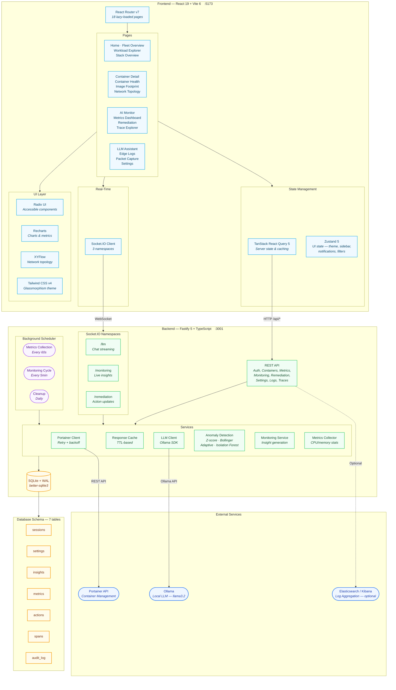

# Architecture

## Architecture Map (Route → Service/Data)

Backend request flow is organized by route modules, with most Portainer-facing routes using the Portainer client + cache/normalizers. Monitoring and metrics read/write directly to SQLite.

| Route Area | Primary Routes | Service/Data Dependencies |
|---|---|---|
| Auth | `/api/auth/*` | `services/session-store.ts`, `services/audit-logger.ts` |
| OIDC | `/api/auth/oidc/*` | `services/oidc.ts`, `services/session-store.ts`, `services/audit-logger.ts` |
| Dashboard | `/api/dashboard/summary` | `services/portainer-client.ts`, `services/portainer-cache.ts`, `services/portainer-normalizers.ts` |
| Endpoints | `/api/endpoints*` | `services/portainer-client.ts`, `services/portainer-cache.ts`, `services/portainer-normalizers.ts` |
| Containers | `/api/containers*` | `services/portainer-client.ts`, `services/portainer-cache.ts`, `services/portainer-normalizers.ts` |
| Container Logs | `/api/containers/:eid/:cid/logs` | `services/portainer-client.ts` |
| Images | `/api/images*` | `services/portainer-client.ts`, `services/portainer-cache.ts`, `services/portainer-normalizers.ts` |
| Networks | `/api/networks*` | `services/portainer-client.ts`, `services/portainer-cache.ts`, `services/portainer-normalizers.ts` |
| Stacks | `/api/stacks*` | `services/portainer-client.ts`, `services/portainer-cache.ts`, `services/portainer-normalizers.ts` |
| Search | `/api/search` | `services/portainer-client.ts`, `services/portainer-cache.ts`, `services/portainer-normalizers.ts` |
| Metrics | `/api/metrics*` | SQLite via `db/sqlite.ts` |
| Monitoring | `/api/monitoring/*` | SQLite via `db/sqlite.ts` |
| Remediation | `/api/remediation/*` | `services/portainer-client.ts`, `services/audit-logger.ts`, SQLite |
| Settings | `/api/settings*` | SQLite via `db/sqlite.ts`, `services/audit-logger.ts` |
| Logs | `/api/logs/*` | `services/notification-service.ts` (test), optional external log backend |
| Traces | `/api/traces*` | SQLite via `db/sqlite.ts` |
| Investigations | `/api/investigations*` | `services/investigation-store.ts` (SQLite) |
| Backup | `/api/backup*` | `services/audit-logger.ts`, filesystem |
| Cache Admin | `/api/admin/cache/*` | `services/portainer-cache.ts`, `services/audit-logger.ts` |
| PCAP | `/api/pcap/*` | `services/pcap-service.ts`, `services/audit-logger.ts` |

## System Overview



## Data Flow


## Tech Stack

| Layer | Technologies |
|-------|-------------|
| **Frontend** | React 19, TypeScript 5.7, Vite 6, Tailwind CSS v4, TanStack Query 5, Zustand 5, React Router 7 |
| **UI Components** | Radix UI, Recharts, XYFlow, cmdk, Lucide Icons, Sonner |
| **Backend** | Fastify 5, TypeScript 5.7, Socket.IO 4, Zod, Jose (JWT), bcrypt |
| **Database** | SQLite (better-sqlite3, WAL mode) |
| **AI** | Ollama (local LLM), optional OpenWebUI support |
| **Logging** | Pino (backend), optional Elasticsearch/Kibana integration |
| **DevOps** | Docker, Docker Compose, GitHub Actions CI |
| **Testing** | Vitest, Testing Library, jsdom |

## Project Structure

```
ai-portainer-dashboard/
├── backend/                        # Fastify API server
│   └── src/
│       ├── routes/                 # REST API endpoints
│       │   ├── auth.ts             #   Authentication (login/logout/refresh)
│       │   ├── containers.ts       #   Container listing & details
│       │   ├── metrics.ts          #   Time-series metrics & anomalies
│       │   ├── monitoring.ts       #   Insights & acknowledgments
│       │   ├── remediation.ts      #   Action approval workflow
│       │   ├── settings.ts         #   Configuration & audit log
│       │   └── ...                 #   Dashboard, endpoints, images, etc.
│       ├── services/               # Business logic
│       │   ├── portainer-client.ts #   Portainer API (retry + backoff)
│       │   ├── portainer-cache.ts  #   Response caching (TTL)
│       │   ├── llm-client.ts       #   Ollama LLM integration
│       │   ├── adaptive-anomaly-detector.ts # Multi-method anomaly detection
│       │   ├── isolation-forest.ts #   Isolation Forest ML algorithm
│       │   ├── isolation-forest-detector.ts # IF model caching + detection
│       │   ├── log-analyzer.ts     #   NLP log analysis (LLM)
│       │   ├── alert-similarity.ts #   Jaccard text similarity grouping
│       │   ├── incident-correlator.ts # Alert → incident correlation
│       │   ├── incident-summarizer.ts # LLM incident summaries
│       │   ├── monitoring-service.ts#  Monitoring cycle orchestration
│       │   ├── metrics-collector.ts#   CPU/memory collection
│       │   └── ...                 #   Sessions, settings, audit, backup
│       ├── sockets/                # Socket.IO namespaces
│       │   ├── llm-chat.ts         #   /llm — streaming chat
│       │   ├── monitoring.ts       #   /monitoring — live insights
│       │   └── remediation.ts      #   /remediation — action updates
│       ├── scheduler/              # Background jobs
│       │   └── setup.ts            #   Metrics (60s), monitoring (5m), cleanup (daily)
│       ├── db/
│       │   ├── sqlite.ts           #   Database init (WAL mode)
│       │   └── migrations/         #   7 SQL migrations
│       ├── models/                 # Zod schemas & DB queries
│       ├── utils/                  # Crypto (JWT/bcrypt), logging (Pino)
│       └── plugins/                # Fastify plugins
├── frontend/                       # React SPA
│   └── src/
│       ├── pages/                  # 18 lazy-loaded page components
│       ├── components/
│       │   ├── layout/             #   App layout, header, sidebar, command palette
│       │   ├── charts/             #   Metrics, pie, bar, sparkline, treemap, sunburst
│       │   ├── container/          #   Container overview, metrics, logs viewers
│       │   ├── network/            #   XYFlow topology graph & nodes
│       │   └── shared/             #   Data table, KPI cards, badges, skeletons
│       ├── hooks/                  # TanStack React Query hooks (25 hooks)
│       ├── stores/                 # Zustand stores (theme, UI, notifications, filters)
│       ├── providers/              # Auth, Socket.IO, Theme, React Query providers
│       └── lib/                    # API client, socket manager, CSV export
├── scripts/
│   └── deploy-workload.sh          # Test workload deployment script
├── docker-compose.yml              # Production (Nginx + Node)
├── docker-compose.dev.yml          # Development (hot-reload)
├── workloads/                       # Multi-stack test workload compose files
│   ├── data-services.yml            #   Postgres, Redis, RabbitMQ
│   ├── web-platform.yml             #   Web tier + API gateway + cron
│   ├── workers.yml                  #   Workers + app-api + app-worker-queue
│   ├── staging-dev.yml              #   Staging + dev environments + monitoring
│   └── issue-simulators.yml         #   Issue containers + heavy-load stress
└── .github/workflows/ci.yml        # CI: typecheck → lint → test → build
```
