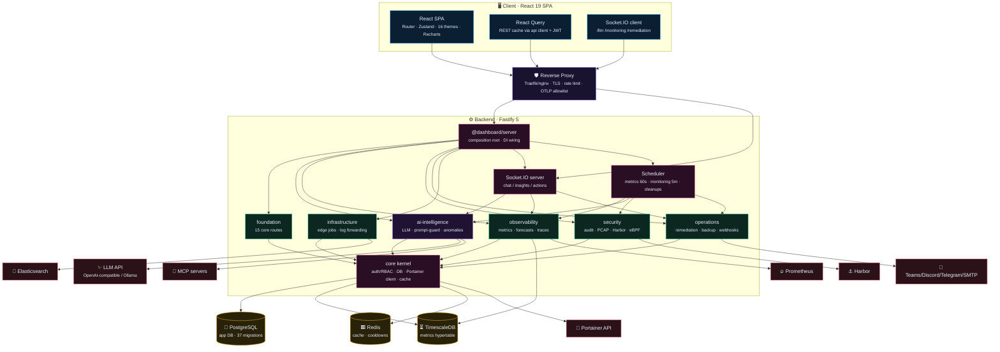
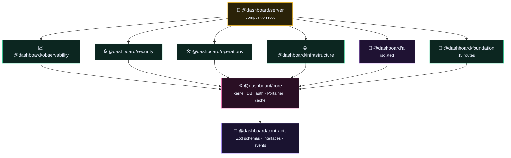
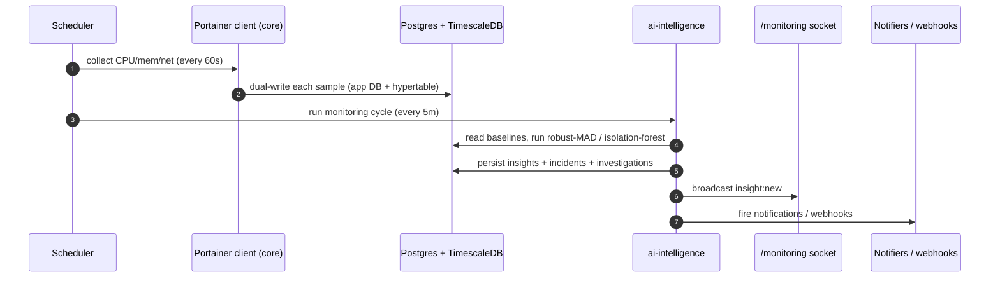
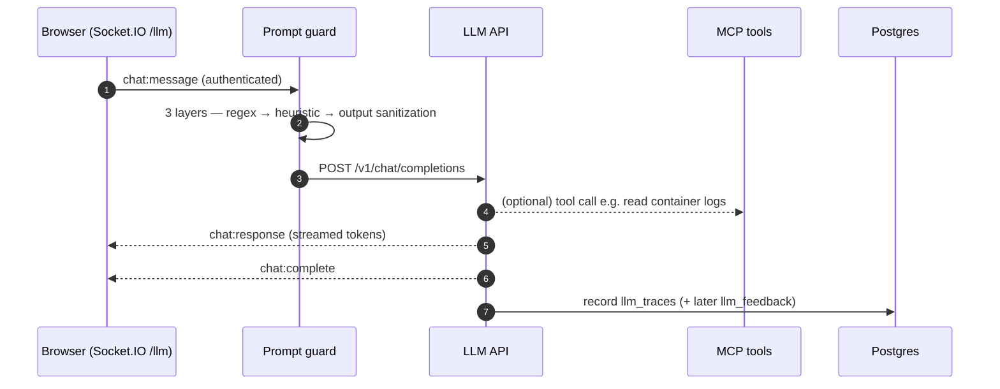
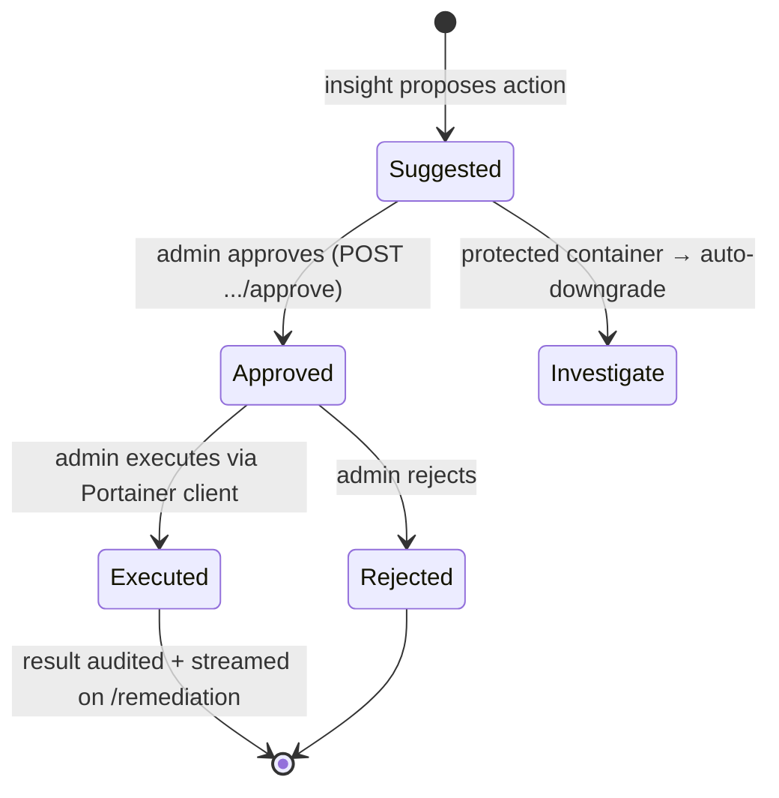
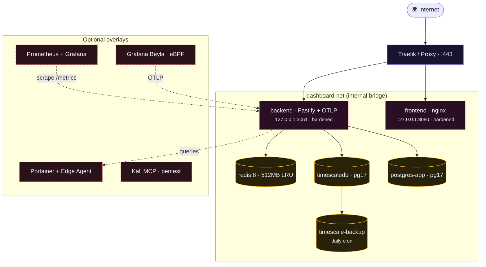

# AI Portainer Dashboard — Software Architecture

> An **observer-first** container-monitoring platform that extends Portainer with real-time
> insights, anomaly detection, and an LLM chat assistant. Visibility comes first; every
> container-mutating action is gated behind RBAC **and** an explicit remediation approval.

This document is the GitHub-rendered companion to the interactive diagram in
[`architecture.html`](./architecture.html) (open it in a browser for hover-to-trace edges,
package dependency view, data flows, and deployment topology).

- **Stack:** Fastify 5 + PostgreSQL/TimescaleDB backend · React 19 + Vite frontend
- **Shape:** npm-workspace monorepo — `backend/`, `frontend/`, and nine `packages/*`
- **Realtime:** Socket.IO namespaces (`/llm`, `/monitoring`, `/remediation`)

---

## 1. System overview

How the browser, edge, backend, data stores, and external systems connect.

| Layer | Components | Responsibility |
|---|---|---|
| **Client** | React SPA, React Query, Socket.IO client | UI, REST data fetching with JWT, live streams |
| **Edge** | Traefik / nginx | TLS termination, routing, rate limiting, OTLP IP allowlist |
| **Backend** | `server`, Socket.IO, Scheduler, 5 domains + `foundation` | API surface, realtime, background jobs, domain logic |
| **Kernel** | `core`, `contracts` | Auth/RBAC, DB, Portainer client, cache, shared types |
| **Data** | PostgreSQL, TimescaleDB, Redis | App state, time-series metrics, cache |
| **External** | Portainer, LLM, Harbor, Prometheus, Elasticsearch, MCP, notifiers | Integrations |

---

## 2. Package dependency graph

The monorepo enforces a strict layering — a package may only import from layers below it.
`ai-intelligence` is deliberately **isolated** (depends only on `core` + `contracts`), and
`server` is the only composition root that wires every domain together.

| Package | npm name | Purpose |
|---|---|---|
| **contracts** | `@dashboard/contracts` | Zod schemas, TS interfaces, typed events — zero deps |
| **core** | `@dashboard/core` | Kernel: DB pools + migrations, JWT/OIDC auth + RBAC, sessions, config, Portainer client + circuit breaker, Redis cache, audit log, event bus, OTLP tracing, Fastify plugins |
| **observability** | `@dashboard/observability` | Metrics ingest/query, ARIMA forecasts, OTLP trace ingest, RED metrics, service map, Prometheus export |
| **security** | `@dashboard/security` | Audit, container scanning, PCAP, Harbor CVE sync, image staleness, eBPF coverage |
| **operations** | `@dashboard/operations` | Remediation workflow, backup/restore, webhooks, notifications |
| **infrastructure** | `@dashboard/infrastructure` | Edge-agent jobs, async log collection, Docker frame decode, Elasticsearch forwarding |
| **ai-intelligence** | `@dashboard/ai` | LLM chat, 3-layer prompt-guard, anomaly detection, incidents, investigations, MCP bridge, prompt profiles |
| **foundation** | `@dashboard/foundation` | 15 routes: auth, OIDC, health, dashboard, containers, logs, stacks, settings, images, networks, search, users, endpoints, k8s, cache-admin |
| **server** | `@dashboard/server` | Fastify app factory, DI wiring, scheduler, Socket.IO namespaces |

---

## 3. Key data flows

### 3a. Monitoring cycle (anomaly detection)

### 3b. LLM chat assistant

### 3c. Remediation — observer-first, gated

---

## 4. Deployment topology

All services run as hardened containers on an isolated `dashboard-net` bridge. Only the
reverse proxy is internet-facing; internal services never bind `0.0.0.0`.

**CI/CD** (`.github/workflows/ci.yml`): `audit → typecheck → lint → backend tests (real
Postgres + Redis) → frontend + Playwright E2E → docker build`. Branch policy enforced;
nightly E2E on `dev`.

---

## 5. Security model (cross-cutting)

- **Auth & RBAC** — JWT via `jose` (32+ char secret), server-side session store in Postgres,
  validated per request. OIDC/SSO via `openid-client` v6 with PKCE. Roles: `viewer` / `operator` / `admin`.
  Mutating endpoints + sensitive reads require `requireRole('admin')`.
- **LLM safety** — 3-layer prompt-injection guard on `/api/llm/query` and `chat:message`.
- **Observer-first** — container-mutating actions gated by `admin` role + remediation approval;
  protected containers auto-downgrade to investigate-only.
- **Infrastructure isolation** — internal services never bind `0.0.0.0`; cross-service calls authenticated.
- **Input & data safety** — Zod on every API boundary, parameterized SQL only, PII scrubbing
  before logging or sending to the frontend.

---

_Generated from a full sweep of `backend/`, `packages/*`, `frontend/`, and `docker/`._
